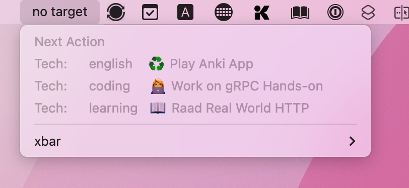

# xbar plugin org-clock




This xbar plugin shows the current clock-in item on the menu bar.
[xbar](https://xbarapp.com/)(ex-BitBar) is a macOS tool that shows the custom message on the menu bar.

## Installation

### xbar

1. Download `org-clock.1m.sh` from this repository.
2. Open xbar plugin folder.
3. Store the script in the above directory.

### Emacs

Create a data directory and then add configuration to init.el.

```bash
mkdir -p ~/.xbar/org-clock/
```

```emacs-lisp
(leaf xbar-org-clock
  :defvar
  (xbar-org-clock-status-file
   xbar-org-clock-agenda-file
   xbar-org-clock-agenda-key
   xbar-org-clock-agenda-sync-interval)
  :custom
  (xbar-org-clock-status-file . "~/.xbar/org-clock/status")
  (xbar-org-clock-agenda-file . "~/.xbar/org-clock/agenda")
  (xbar-org-clock-agenda-key  . "n")
  (xbar-org-clock-agenda-sync-interval . 1800) ;; 30m
  :preface
  (defun xbar-org-clock--write-agenda ()
    (progn
      (org-agenda nil xbar-org-clock-agenda-key)
      (org-agenda-write xbar-org-clock-agenda-file)))
  (defun xbar-org-clock--write-clockin-status ()
    (with-temp-buffer
      (insert (concat
               (format-time-string "%s" org-clock-start-time)
               "\t"
               org-clock-heading))
      (write-region (point-min) (point-max) xbar-org-clock-status-file)))
  (defun xbar-org-clock--delete-clockin-status ()
    (delete-file xbar-org-clock-status-file))
  :hook
  (org-clock-in-hook     . xbar-org-clock--write-clockin-status)
  (org-clock-out-hook    . xbar-org-clock--delete-clockin-status)
  (org-clock-cancel-hook . xbar-org-clock--delete-clockin-status)
  :config
  (run-with-timer 0 xbar-org-clock-agenda-sync-interval 'xbar-org-clock--write-agenda))
```

## References

- [matryer/xbar-plugins - Writing plugins](https://github.com/matryer/xbar-plugins/blob/main/CONTRIBUTING.md#metadata)
- [org-modeでclock-inしているタスクをMacのメニューバーに表示する](https://qiita.com/tamanugi/items/ef43056d5c9709e4f7ab)
